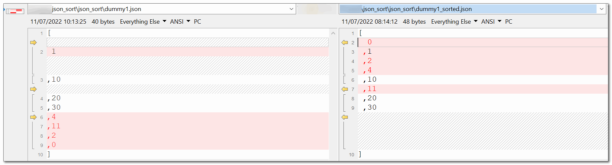

```txt
json_sort
═════════════
deep-sort JSON files.
handles plain text files too.
═════════════════════════════════
uses natural sort, and writes new files 
with '_sorted' add to file-name (same extension).
═════════════════════════════════════════════════════
 "file" "file"..    	read, sort (natural), write new file. on errors, skip.
 --unique           	remove duplicates (lines in text/values in arrays).
 --no-beautify      	json output will not be beautified.
 --eol-win          	force \r\n (CR+LF) everywhere, instead of your OS defaults.
 --eol-linux        	force   \n    (LF) everywhere, instead of your OS defaults.
 --help             	show this help.
 --verbose          	show some debug information (written to STDERR).
════════════════════════════════════════════════════════════════
                                               EladKarako 2022.
```

<br/>
<br/>
<br/>

I've slightly improved the initial project https://github.com/eladkarako/nodejs_cli_starting_point  
and modified it to do a slightly different thing, but using the same core functionality,  
it is now a json sorter,  
meaning it will read a textual content from a file,  
and try to parse it into a json object,  
then it will create a new object based on its naturally sorted keys,  
and recursive sort its component.  

it supports any componenent you can put into a json textual content file,  
original values are kept, the sorting algorithm uses something called an extraction rule,  
in the sorting phase, numbers are parsed as strings and everything is compared with respect to localization,  
anything else that is not comparable (sub items of an array that are anything other than a string or a number),  
are returned as is, and the next recursive call will eventually deep sort them too.

additional switches such as `--unique` will effect text files and array, removing duplicated lines and values,  
and EOL switches to normalize end of line characters to other than the OS default,  
there is `--no-beautify` to do not write a beautified output (for json content).

anything that it can not be parsed as JSON due to `JSON.parse` failing,  
will be parsed as a simple multiline text-content.  

the program always presents the identified arguments.

this is still an example for a starting point for simple tiny nodejs single script file, with no dependencies,  
but now it is slightly more functional as well :]

